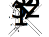

# ME 5180: Advanced Dynamics | Project 02 | Group 8
## Project Requirements: 
This project focuses on analyzing and simulating a mechanical system with constrained motion. A rigid bar connects two pistons that slide along diagonal tracks, and as the bar rotates at a constant angular velocity, the pistons are forced to move accordingly.

## Main Goals:
* Develop a mathematical model of the system using constraint equations
* Analyze how motion of one part affects the rest
* Compute:
  * Positions
  * Velocities
  * Accelerations
* Create a visual simulation of the motion

